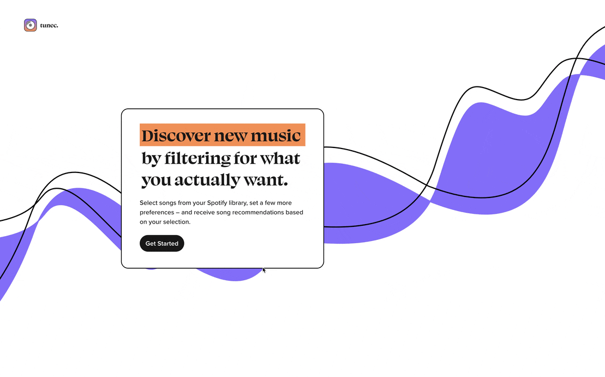

# tunec – Spotify recommendations
A web app that uses the Spotify API to give you more control over song recommendations by offering the ability to select multiple seed tracks and influence some musical attributes.

This project was developed as part of the thesis of Sonja Brehm, MSc Data Science and AI for the Creative Industries, 2023; Supervisor: Dr Louis McCallum. 

## Local Installation & Set Up

1. Create an app in the [Spotify Developer Dashboard](https://developer.spotify.com/dashboard/) and add `http://localhost:8888/callback` as a Redirect URI.

2. Create a `.env` file at the root of this project based on `.env.example`. Add your Client ID and Client Secret from the Spotify Dashboard.

5. Install all dependencies by running `npm install` in the terminal in the root directory of the project (you need to have Node.js and npm installed for this - the node version used is 18.16.1)

6. Start the React app and the node server by running `npm start` in the terminal in the root directory of the project

## Structure
- The index.js file at the root of this project contains the code for the node server.
- The client folder contains all code for the react app. The code in the scr folder is split into the folders components (= single building blocks) and pages (= complete code for each page).
